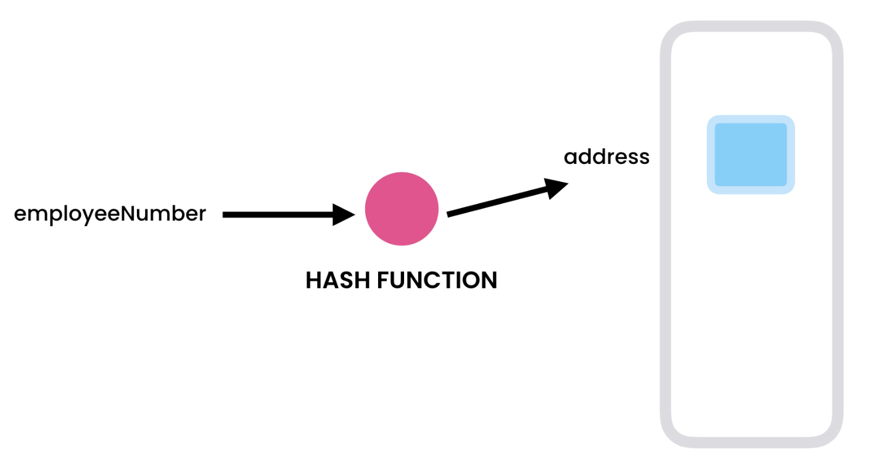

### HasMaps

- Hashmap is an implementation of HashTable. In JavaScript Object is the implementation of HasTable.
- Spell Checker, Dictionary, any place where quick lookup is important.
- Internally HasTable uses an array to store the objects in Java.
- Insert, Lookup, Delete all have O(1) time complexity.

