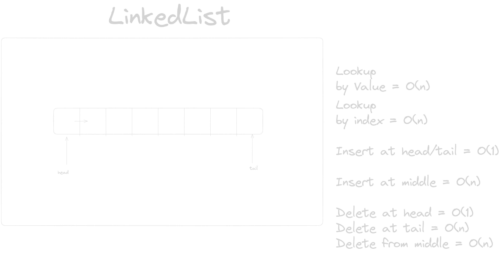

### Arrays vs ArrayList vs Linked List

- Arrays needs to have fixed size. ArrayList are for dynamic length. LinkedList are also dynamic but performant.
- ArrayList grow by 50% - 100%.
- LinkedList always has O(1) time complexity for insert.
- Use arrays if you know length beforehand. Use LinkedList if you don't.
- LinkedList in Java is doubly LinkedList.
- LinkedList in Java under the hood implements Queue interface.